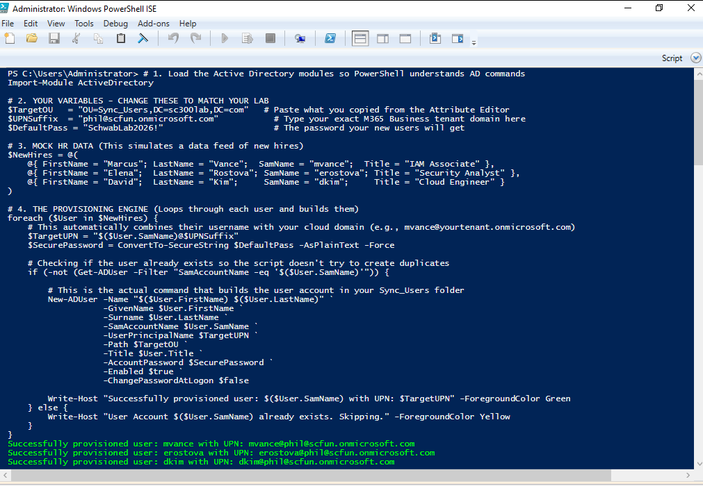
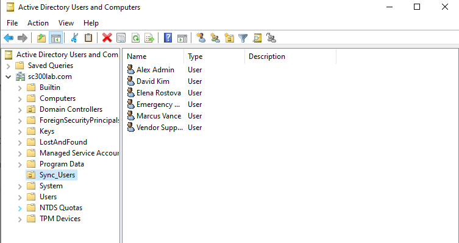
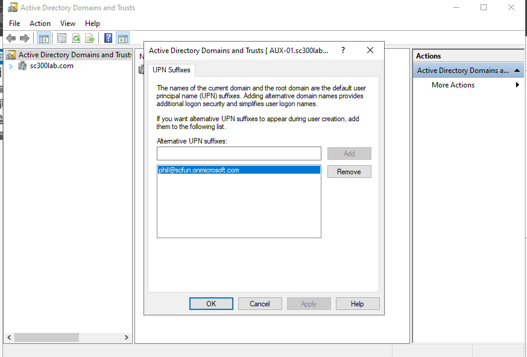
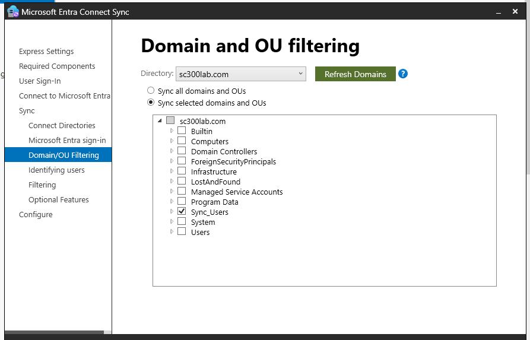
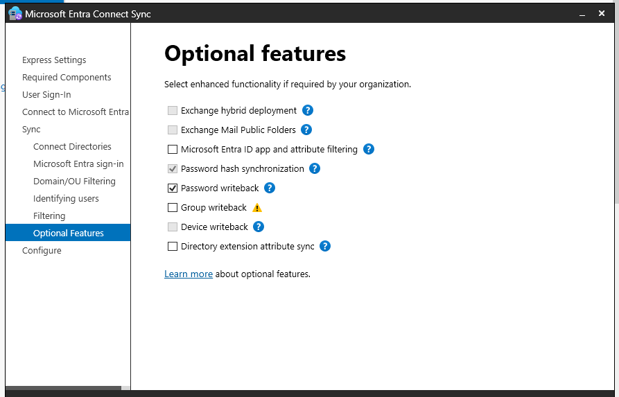
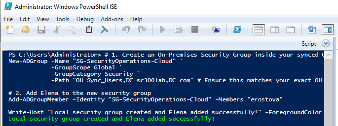
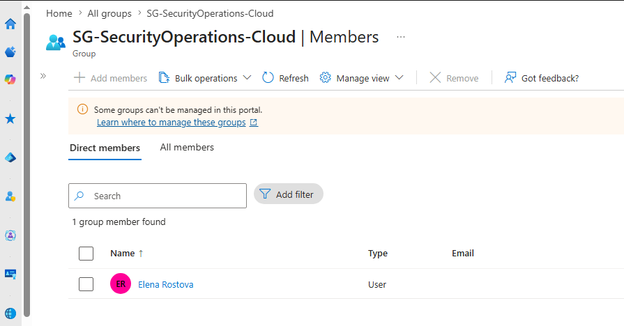

# Enterprise Hybrid Identity Lifecycle & Directory Synchronization Lab

## Project Overview
This project demonstrates the implementation of a production-grade hybrid identity architecture, bridging an on-premises Active Directory Domain Services (AD DS) infrastructure with a Microsoft 365 / Microsoft Entra ID cloud tenant. 

Designed to mirror strict corporate security baselines, this architecture enforces data minimization via scoped Organizational Unit (OU) filtering, utilizes automated lifecycle scripting, and implements bidirectional password mechanics via Password Hash Synchronization (PHS) and Password Writeback.

## Architectural Design
The architecture establishes a secure synchronization pipeline between a local Windows Server 2022 Domain Controller and Microsoft Entra ID via the Microsoft Entra Connect engine.

* **Source of Truth:** On-Premises Active Directory (`sc300lab.com`)
* **Target Directory:** Microsoft Entra ID Tenant
* **Identity Provisioning:** Automated via Parameterized PowerShell
* **Synchronization Scope:** Restricted exclusively to an isolated Security/Sync OU

---

## Phase 1: Automated On-Premises "Joiner" Provisioning
To align with corporate identity standards and eliminate manual administrative overhead, a parameterized PowerShell script was developed to handle the bulk ingestion of standard and specialized organizational personas into a dedicated `Sync_Users` OU.

The script dynamically appends the alternative routable User Principal Name (UPN) suffix to ensure zero mapping collisions upon cloud ingestion, and checks for account existence to guarantee script idempotency.

```powershell
# 1. Load the Active Directory modules so PowerShell understands AD commands
Import-Module ActiveDirectory

# 2. CONFIGURATION VARIABLES
$TargetOU   = "OU=Sync_Users,DC=sc300lab,DC=com"      # Target OU Distinguished Name
$UPNSuffix  = "yourtenant.onmicrosoft.com"             # Target M365 Domain (Update this!)
$DefaultPass = "SchwabLab2026!"                        # Secure temporary bootstrap password

# 3. CORE ENTERPRISE PERSONA MATRIX (Simulating HR Data Ingestion)
$Roster = @(
    # Standard Personas
    @{ FirstName = "Marcus";    LastName = "Vance";      SamName = "mvance";      Title = "IAM Associate" },
    @{ FirstName = "Elena";     LastName = "Rostova";    SamName = "erostova";    Title = "Security Analyst" },
    @{ FirstName = "David";     LastName = "Kim";        SamName = "dkim";        Title = "Cloud Engineer" },
    
    # Specialized/Privileged Personas
    @{ FirstName = "Alex";      LastName = "Admin";      SamName = "alexadmin";   Title = "Helpdesk Administrator" },
    @{ FirstName = "Vendor";    LastName = "Support";    SamName = "vsupport";    Title = "Third-Party Contractor" },
    @{ FirstName = "Emergency"; LastName = "BreakGlass"; SamName = "breakglass01";Title = "Break-Glass Account Override" }
)

# 4. PROVISIONING ENGINE
foreach ($User in $Roster) {
    $TargetUPN = "$($User.SamName)@$UPNSuffix"
    $SecurePassword = ConvertTo-SecureString $DefaultPass -AsPlainText -Force

    # Structural Check: Ensure account doesn't already exist before creating
    if (-not (Get-ADUser -Filter "SamAccountName -eq '$($User.SamName)'")) {
        
        New-ADUser -Name "$($User.FirstName) $($User.LastName)" `
                   -GivenName $User.FirstName `
                   -Surname $User.LastName `
                   -SamAccountName $User.SamName `
                   -UserPrincipalName $TargetUPN `
                   -Path $TargetOU `
                   -Title $User.Title `
                   -AccountPassword $SecurePassword `
                   -Enabled $true `
                   -ChangePasswordAtLogon $false
        
        Write-Host "Successfully provisioned enterprise persona: $($User.SamName) as $TargetUPN" -ForegroundColor Green
    } else {
        Write-Host "Account identity $($User.SamName) already exists. Skipping creation." -ForegroundColor Yellow
    }
}
```





## Phase 2: Scoped Directory Synchronization (Data Minimization)
Rather than executing a standard "Express" configuration—which risks exporting unroutable service accounts, local computer discovery logs, and default administrative paths to the public cloud—a **Custom Installation** of Microsoft Entra Connect was engineered.



### Security Baseline Configuration:
1. **Authentication Engine:** Password Hash Synchronization (PHS) enabled to safely process cryptographic password representations.
2. **Scoped OU Filtering:** Disabled root domain broad-sync. Configured the engine to strictly evaluate and synchronize the `Sync_Users` OU folder only.
3. **Bidirectional Password Lifecycle:** Enabled **Password Writeback** to support Self-Service Password Reset (SSPR) and maintain password parity between the cloud and the secure local perimeter.

### Verification: Scoped Sync Pipeline Configuration



## Phase 3: Cloud Ingestion & Identity Governance Verification
Following the completion of the synchronization engine configuration, a comprehensive cloud audit was performed within the Microsoft Entra Admin Center portal. 

All six specialized on-premises identities successfully registered in the cloud tenant with a directory authorization state of `On-premises sync enabled: Yes`.


### Hybrid Access Modification (Mover Scenario)
To simulate an active access modification ticket (the "Mover" phase of JML lifecycle management), an on-premises security group was engineered via administrative shell tools, and an identity was nested inside. 

To bypass the standard 30-minute background sync interval, an immediate manual delta synchronization cycle was forced via PowerShell to instantly enforce the access governance change across the hybrid boundary:




```powershell
# 1. Create an On-Premises Security Group inside the synchronized OU path
New-ADGroup -Name "SG-SecurityOperations-Cloud" `
            -GroupScope Global `
            -GroupCategory Security `
            -Path "OU=Sync_Users,DC=sc300lab,DC=com"

# 2. Dynamically modify user access profile by nesting identity inside group
Add-ADGroupMember -Identity "SG-SecurityOperations-Cloud" -Members "erostova"

# 3. Administrative Power-Move: Force immediate delta synchronization replication
Start-ADSyncSyncCycle -PolicyType Delta
```

## Bonus
### Advanced Lifecycle Testing: Bulk Account Suspension (SecOps Scenario)
To simulate an immediate incident response or bulk offboarding event, a secondary script was executed to instantly disable all six targeted identities at the directory level.

#### Suspension Script Execution:


#### Target Directory Suspended State:
The downward arrows on the user objects visually confirm that the accounts are explicitly disabled across the domain:


---

---

## Phase 3: Cloud Access Governance via Identity-as-Code (IdaC)
**Objective:** Programmatically orchestrate Zero-Trust access controls within the Microsoft Entra ID tenant using HashiCorp Terraform, eliminating manual UI configuration risk and enforcing continuous security posture baselines.

### 🛠️ Architectural Strategy & Design
Instead of performing manual click-ops inside the Azure portal, the tenant's security layer was codified using declarative **HashiCorp Configuration Language (HCL)**. 

To achieve production-grade consistency, the pipeline utilizes **Dynamic Data Sources** rather than hardcoding sensitive object GUIDs. Terraform dynamically queries the live directory at runtime to look up the newly synchronized on-premises identities (`alexadmin` and `vsupport`) using their User Principal Names (UPNs) and binds them directly to targeted access perimeters.

### 📝 Codebase Architecture

The deployment infrastructure is split cleanly into a dedicated `terraform/` directory:

#### 1. Provider Infrastructure Initialization (`provider.tf`)
Defines the required HashiCorp Microsoft Entra ID (`azuread`) engine hooks and establishes the Azure CLI interactive authentication bridge.
```hcl
terraform {
  required_providers {
    azuread = {
      source  = "hashicorp/azuread"
      version = "~> 2.48.0"
    }
  }
}

provider "azuread" {
  # Authenticated securely via active local Azure CLI session tokens
}
```
### 2. Core Zero-Trust Boundary Matrix (main.tf)
Defines environment variables, resolves dynamic object identities, and declares two distinct conditional access restrictions.
# Global Tenant Context Variables
variable "tenant_domain" {
  type        = string
  default     = "scfun.onmicrosoft.com" # Target directory primary suffix
  description = "The target primary domain suffix for the Entra ID tenant."
}

# Dynamic Directory Identity Lookups (Data Sources)
data "azuread_user" "admin_user" {
  user_principal_name = "alexadmin@${var.tenant_domain}"
}

data "azuread_user" "vendor_user" {
  user_principal_name = "vsupport@${var.tenant_domain}"
}

# Zero-Trust Policy 01: Enforce MFA for Administrative Personas
resource "azuread_conditional_access_policy" "mfa_for_admins" {
  display_name = "SEC-CAP-01-MFA-For-Administrators"
  state        = "enabled"

  conditions {
    client_app_types = ["all"]
    
    applications {
      included_applications = ["All"]
    }

    users {
      included_users = [data.azuread_user.admin_user.object_id]
    }
  }

  grant_controls {
    operator          = "OR"
    built_in_controls = ["mfa"]
  }
}

# Zero-Trust Policy 02: Restrict Third-Party Vendor Access
resource "azuread_conditional_access_policy" "vendor_security_gate" {
  display_name = "SEC-CAP-02-Vendor-Security-Gate"
  state        = "enabled"

  conditions {
    client_app_types = ["all"]

    applications {
      included_applications = ["All"]
    }

    users {
      included_users = [data.azuread_user.vendor_user.object_id]
    }
  }

  grant_controls {
    operator          = "OR"
    built_in_controls = ["mfa"]
  }
}

Continuous Deployment Pipeline Workflow
Execution and enforcement were carried out inside a standard Infrastructure-as-Code pipeline via PowerShell:

Initialize the Working Directory:

PowerShell
terraform init
Downloads the required HashiCorp Microsoft Graph API integration plugins.

Generate the Execution Strategy (Dry Run):

PowerShell
terraform plan
Evaluates configuration state against active cloud tenant schema to preview changes before modification.

Enforce Target Posture:

PowerShell
terraform apply -auto-approve
🔍 Real-World Engineering Problem Remediation
The Obstacle: Initial orchestration deployment phases failed with an API BadRequest response from Microsoft Graph:

"Security Defaults is enabled in the tenant. You must disable Security defaults before enabling a Conditional Access policy."

The Root Cause Analysis: Greenfield Microsoft Entra ID tenants deploy with legacy un-customizable "Security Defaults" turned on natively. The Microsoft Graph API explicitly blocks custom conditional access engine evaluation if these underlying base settings are active.

The Solution: Executed an administrative override within the tenant overview configuration panel to safely disable Security Defaults, explicitly citing the transition to advanced granular Conditional Access policies.

Upon remediation, the pipeline immediately passed validation checks and successfully initialized both active rules.

📊 Verification & Visual Evidence
1. Command-Line Execution Output
Successful infrastructure provisioning via the local automation runtime, confirming both active security resources were pushed upstream cleanly:

2. Cloud Directory Status Validation
The Microsoft Entra ID administration panel confirms that both programmatic security wrappers are fully active, enforcing real-time Zero-Trust policies across the tenant:
---

## Phase 4: Securing Emergency Access (Break-Glass Monitoring)
**Objective:** Architect a continuous cloud monitoring telemetry pipeline to detect and alert on unauthorized utilization of the emergency break-glass account (`breakglass01`).

### Security Strategy
Emergency access accounts hold highly privileged global roles but are explicitly bypassed from Conditional Access MFA rules to prevent lockout during a widespread identity provider outage. Due to the high risk of account compromise, a zero-trust real-time monitoring solution was designed using Azure Monitor and Kusto Query Language (KQL).

### Detection Engineering (KQL Query)
The following query is deployed within an Azure Log Analytics Workspace, scheduled to run every 5 minutes with an alert threshold of `> 0` results:

```kusto
SigninLogs
| where UserPrincipalName =~ "breakglass01@scfun.onmicrosoft.com"
| where Status.errorCode == 0 
| project TimeGenerated, UserPrincipalName, IPAddress, Location, ClientAppUsed, ResultDescription
